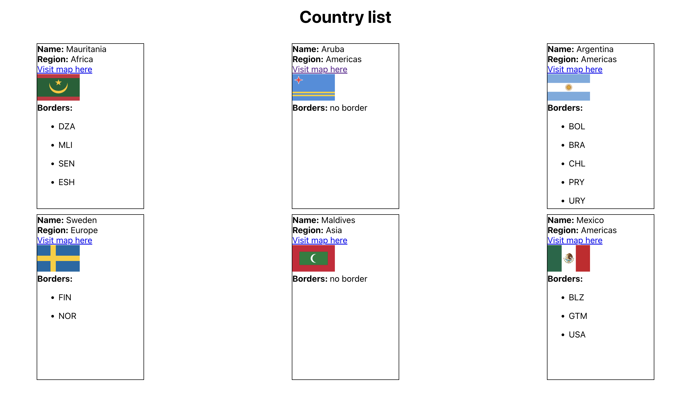
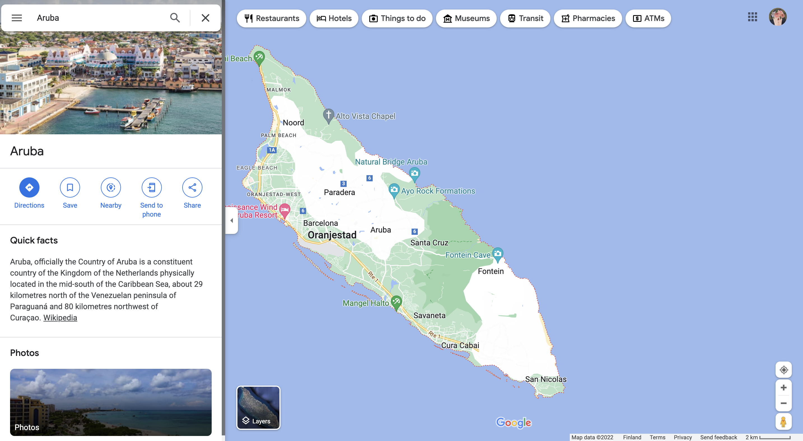

# React hook assignment - useEffect

## How to run the project

1. Step 1: yarn
2. Step 2: yarn start

## Requirements

1. The url for this task: `https://restcountries.com/v3.1/all`
2. Use fetch or axios to get the 250 countries in the `App.js`
3. Only display 6 countries on the screen
4. The country detail should be in the `Country.js` component
5. Each country must have name, region, google map link, image and borders
6. Styling is up to you - Be creative 🇫🇮 🇩🇪 🇳🇴

## Screenshot

When the user click the `Visit map here` it should go to a google map page

